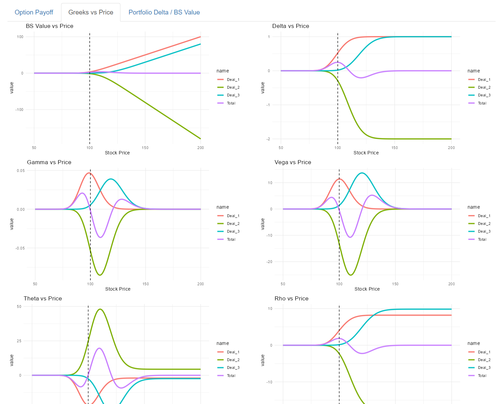
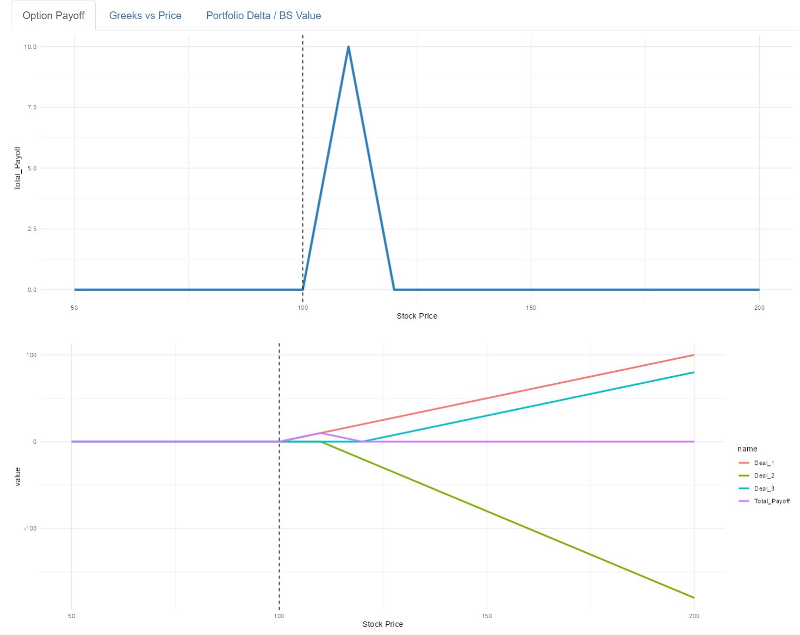

# R-Shiny-Option-Payoff-Analyzer

A web-based financial tool built with **R Shiny** to perform real-time analysis of option contracts. This application allows users to input specific deal parameters to visualize payoff profiles and calculate essential Greeks.

## Mathematical Foundation
This tool utilizes the **Black-Scholes-Merton** model for option pricing. The dashboard evaluates both the intrinsic payoff at expiration and the theoretical market price:

$$Call = \max(S_T - K, 0) \quad | \quad C = S_0 N(d_1) - Ke^{-rT}N(d_2)$$

$$Put = \max(K - S_T, 0) \quad | \quad P = Ke^{-rT}N(-d_2) - S_0 N(-d_1)$$

*Where:*
* $S_0$: Current price of the underlying asset
* $K$: Strike price
* $r$: Risk-free interest rate
* $T$: Time to expiration
* $N(d)$: Cumulative distribution function of the standard normal distribution

## Application Preview



## Features
* **Payoff Analysis:** Interactive visualization of profit/loss profiles at expiration.
* **Greeks Calculation:** Real-time computation of Delta, Gamma, Theta, Vega, and Rho.
* **Position Analysis:** Aggregate risk assessment for complex option strategies.

## Getting Started

### Prerequisites
You need R installed on your system. It is recommended to use **RStudio**.

### Installation
1. Clone the repository:
   ```bash
   git clone [https://github.com/MehrdadHeyrani/R-Shiny-Option-Payoff-Analyzer.git](https://github.com/MehrdadHeyrani/R-Shiny-Option-Payoff-Analyzer.git)
